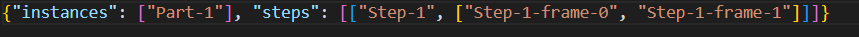
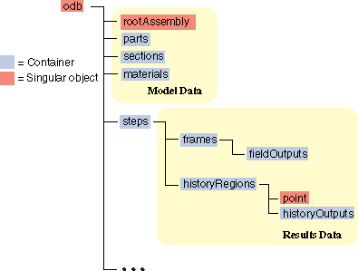

# Abaqus output database to VTK converter

## Introduction
Abaqus output database (.odb extension) is a binary file native to Abaqus. To access the data from ODB file, without reverse engineering, is to use offical Abaqus APIs which are provided in Python or C++. This project contains python scripts to convert .odb file to .vtu file which can be opened by ParaView. 

## Usage
ODB2VTK is a command line tool. 

`abaqus python odb2vtk.py --header 1 --odbFile <my_odb_file_path>/my_odb_file.odb`

This will open the odb file, extract instances, steps, and frames, and save them into a JSON file in the same directory of the odb file.  

`abaqus python odb2vtk.py --header 0 --instance "Part-1" --step "Step-1:0,1" --odbFile <my_odb_file_path>/my_odb_file.odb`

This will extract output data for instance "Part-1" at "Step-1" with frame number 0 and 1.
To convert multiple instances and steps. Use whitespace to separate the arguments.

`abaqus python odb2vtk.py --header 0 --instance "Part-1" "Part-2" --step "Step-1:0,1" "Step-3:0,1,2,3,4,5" "Step-3:0,1,2,3" --odbFile <my_odb_file_path>/my_odb_file.odb`

To utilize multiprocessing in Python, another script 'multiprocess.py' is provided to spawn 'Abaqus python' call in parallel.

`python multiprocess.py --header 0 --instance "Part-1" "Part-2" --step "Step-1:0,1" "Step-3:0,1,2,3,4,5" --odbFile <my_odb_file_path>/my_odb_file.odb`

What this essentially does is to spawn a 'Abaqus python' call for each frame like the following in parallel.

`abaqus python odb2vtk.py --header 0 --instance "Part-1" "Part-2" --step "Step-1:0" --odbFile <my_odb_file_path>/my_odb_file.odb`

`abaqus python odb2vtk.py --header 0 --instance "Part-1" "Part-2" --step "Step-1:1" --odbFile <my_odb_file_path>/my_odb_file.odb`

`abaqus python odb2vtk.py --header 0 --instance "Part-1" "Part-2" --step "Step-3:0" --odbFile <my_odb_file_path>/my_odb_file.odb`

`abaqus python odb2vtk.py --header 0 --instance "Part-1" "Part-2" --step "Step-3:1" --odbFile <my_odb_file_path>/my_odb_file.odb`

`abaqus python odb2vtk.py --header 0 --instance "Part-1" "Part-2" --step "Step-3:2" --odbFile <my_odb_file_path>/my_odb_file.odb`

`abaqus python odb2vtk.py --header 0 --instance "Part-1" "Part-2" --step "Step-3:3" --odbFile <my_odb_file_path>/my_odb_file.odb`

`abaqus python odb2vtk.py --header 0 --instance "Part-1" "Part-2" --step "Step-3:4" --odbFile <my_odb_file_path>/my_odb_file.odb`

`abaqus python odb2vtk.py --header 0 --instance "Part-1" "Part-2" --step "Step-3:5" --odbFile <my_odb_file_path>/my_odb_file.odb`

## Design

### Generality
Abaqus ODB file has the following tree structure. For generality, we want to give end users the freedom to specify which instance, which step, and which frame in the step to be converted. It is not uncommon to have a large ODB file with many instances, steps and frames but we only want to convert a few of them. ODB2VTK is also designed to be extendable. New element can be easily added to the source code with only two lines of code. ODB2VTK is designed to extract every fieldOutput exists in the ODB file.

### Performance
Performance will be an issue. The first principle is to avoid explicit for loop to traverse nodes and elements in Python, but to use vectorization. But data array has to be written line by line per node and cell into VTU file. Not sure how much we can improve here (maybe write to VTU binary?). Nevertheless, I am satisfied by the performance. 
On my machine (i7-8750H CPU@2.20GHz, 32GB ram), I converted a ~ 1GB .odb file which has C3D4 C3D8R C3D10 element types, 117972 elements, and 81959 nodes within less 3 minutes for 1 frame. Generality comes at a cost of performance. Converting multiple instances with different element types into one VTU file will be slower than converting them into separate VTU files. This is because VTK XML format requires one data array to have the same number of components. Suppose I have the first instance which has 8 integration points (6 * 8=48 values per element) and the second instance which has 1 integration point (6 * 1=6 values per element). When ODB2VTK writes stress output at integration points, the number of componenets is set to be the largest (48 in the case). Untouched data entry for elements from the second instance will be 0 and written to VTU. This chunk of data is redundant which inevitably increases file size as well as runtime. So if you have an odb file where integration points vary greatly, just convert each instance separately.

### Responsibility
ODB2VTK should do nothing more than extract any data that exists in the odb file and write it to a vtu file. Any extra computation, especially the ones which perform at the element or node level if they can't be vectorized, will slow down the conversion process. So, the responsibility of ODB2VTK is just write data from ODB in 'as is' condition. Any post-processing operation is recommended to be placed in ParaView. For instance, applying a scale factor to displacement field to visualize the deformed shape can be easily archieved using the a filter in ParaView.  

## Abaqus label to VTK index mapping
Abaqus odb file uses different indexing system than VTK XML file. Each node and element in Abaqus has a label which is used to define their connectivity. A VTK XML file has index of nodes and elements starting from 0 whereas an odb file has label starting from 1. Addtionally, each instance in an odb file has their own labeling for both nodes and elements which means two different instances can have identical labels for their own nodes and elements. Therefore, we need to have some kind of hashmap to map a label in an odb file to an index in a VTK XML file. This is done via two private dictionares in the ODB2VTK class:

self._nodes_map = {}
self._elements_map = {}

self._nodes_map['instanceName'][label] gives us the index of the node with the label in instanceName instance. 
self._elements_map['instanceName'][label] gives us the index of the element with the label in instanceName instance. 

## Abaqus element to VTK cell
VTK cell must have the same topology as in abaqus for it to be correctly visualized. See [Linear Cells](https://raw.githubusercontent.com/Kitware/vtk-examples/gh-pages/src/Testing/Baseline/Cxx/GeometricObjects/TestLinearCellDemo.png) and [Isoparametric Cells](https://raw.githubusercontent.com/Kitware/vtk-examples/gh-pages/src/Testing/Baseline/Cxx/GeometricObjects/TestIsoparametricCellsDemo.png)

Abaqus python API provides a member variable 'type' in the element object, e.g., ele.type which returns a string like 'C3D10'.
ODB2VTK is designed in such a way that we only need to create the map to convert abaqus element type to the enum value corresponding to the correct cell type in VTK. This is done in ABAQUS_VTK_CELL_MAP. If you want to add a new element type from Abaqus, all you have to do is to add a new elif condition to return the correct enum for VTK.

	def ABAQUS_VTK_CELL_MAP(abaqusElementType):
		if 'C3D4' in abaqusElementType:
			return 10
		elif 'C3D6' in abaqusElementType:
			return 13
		elif 'C3D8' in abaqusElementType:
			return 12
		elif 'C3D10' in abaqusElementType:
			return 24
		elif 'C3D15' in abaqusElementType:
			return 26
		elif 'C3D20' in abaqusElementType:
			return 25
		elif 'S3' in abaqusElementType:
			return 5
		elif 'S4' in abaqusElementType:
			return 9
		elif 'S8' in abaqusElementType:
			return 23	
		elif 'S9' in abaqusElementType:
			return 28
		elif 'R3D3' in abaqusElementType:
			return 5
		elif 'R3D4' in abaqusElementType:
			return 9
		else:
			return None

## Integration points and section points
In VTK, data can be visualized either per cell or per node. For all the nodal output from Abaqus, we just create data array for each node. But things get tricky for element output as one element can have more than one data array. In particular, we need to address two properties: integration points and section points. 

Reduced integration elements typically have only one integration point which doesn't cause any issue as it meets 'one data per element' pattern. But for the case of higher order elements which have more than one integration points, we usually have two options in terms of visualization in VTK: 1) get the weighted averaged value from all the integration points of the element and visualize it per element. 2) Extrapolate values at the nodal positions from the integration points and visualize it per node. The default contour plot in Abaqus uses the latter. For more reference, see Abaqus reference [here](https://abaqus-docs.mit.edu/2017/English/SIMACAECAERefMap/simacae-c-resconceptcompute.htm) and [here](https://abaqus-docs.mit.edu/2017/English/SIMACAECAERefMap/simacae-c-conconceptcompute.htm). We can use `getSubset(position=CNETROID)` to the get the weighted averaged value at the centroid of the element or use `getSubset(position=ELEMENT_NODAL)` to get the extrapolated values at the node. Unfortunately, the API `getSubset(position=ELEMENT_NODAL)` doesn't get the post-averaged values in Abaqus. So, we have to average it by ourselves. Moreover, Abaqus implements a threshold to instruct how a value at a nodal position is averaged over each adjacent element. This just makes it more complicated if we want to generate the same contour plot in Abaqus. While this logic is not difficult to implement in Python, I haven't yet found an efficient way to archieve this without using nested for loops. It must be noted that both approaches do not represent the actual state of the output. You must interpret it with discretion. For this reason, the current version of ODB2VTK class only writes output at integration points to centroid, which is very convenient since getSubset(position=CENTROID) directly gives us weighted averaged values per element. 

The most accurate way is to just use values at the integration points. ODB2VTK class will export output at integration points which can be further processed in ParaView. For instance, to generate a failure plot, we will use neither the weighted average stress/strain at the centroid nor extrapolated value at nodes, but use the stress/strain at integration points. In VTK XML, each element has a n component tensor data array where n = number of integration x 6. Once the .vtu file is opened in ParaView, we can create filters to access this data.

Another scenario when a element has more than one data array is that the element has multiple section points. This usually happens for reduced dimension elements such as shell elements. Section point is used to get output values at a different location in the thickness direction of the element. This is handled by ODB2VTK class. It will export as many section points as requested in the odb file. For instance, 'S4R' element by default has SPOS (stress state at the top surface) and SNEG (stress state at the bottom surface) for stress output. ODB2VTK will export all of them. 

## Additional fieldOutput
In ODB2VTK class, there is a method WriteLocalCS to write material orientation. This is just a custom output written into VTK. Since we are dealing with anisotropic materials, we would like to visualize it in ParaView. You can use the same pattern to write other custom output from ODB file.

## History output
ODB2VTK also extracts all the historyOutput in the odb file and write them into a CSV file which can be opened by ParaView to have a line chart view.

## Naming convention 
You can find the pattern for output file in the WriteVTUFile method. As different frames will produce different results, the output file name must include frame number to avoid name clash. The current setting is to append "_stepName_frameNumber" at the end of odb file.

## Resources
Abaqus Scripting Reference Manual

